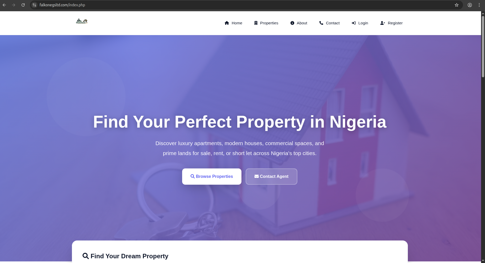
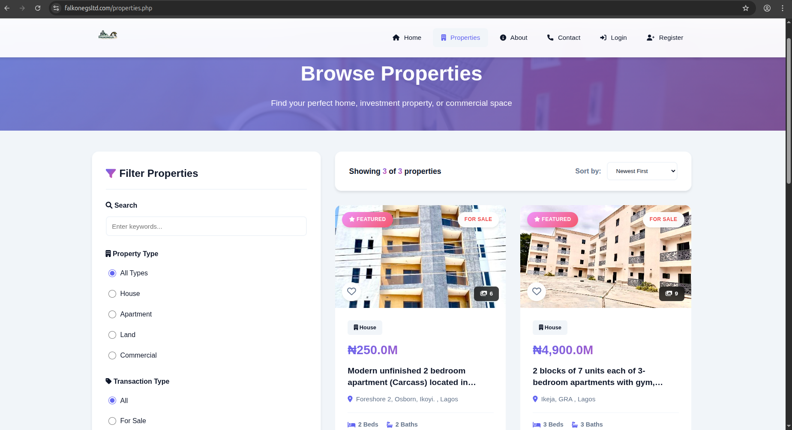
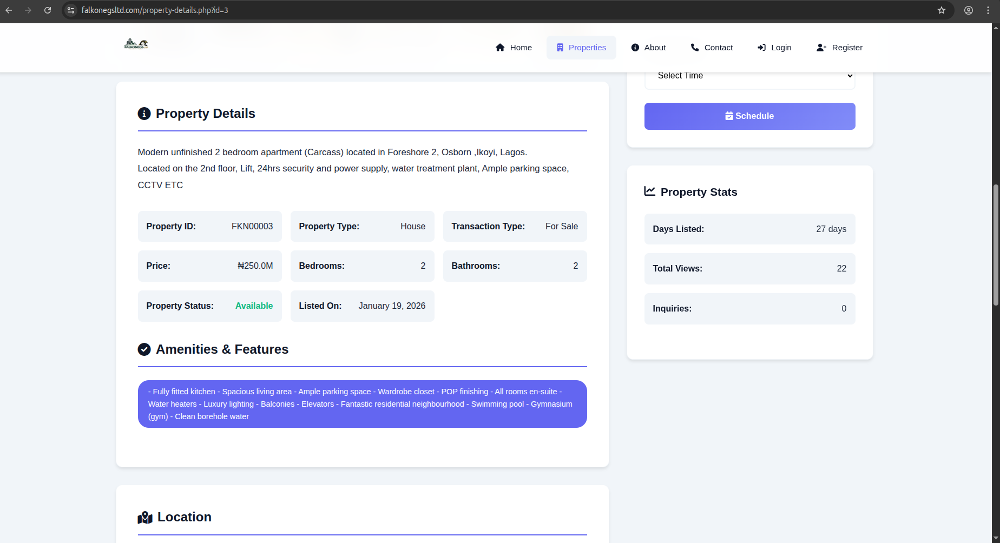
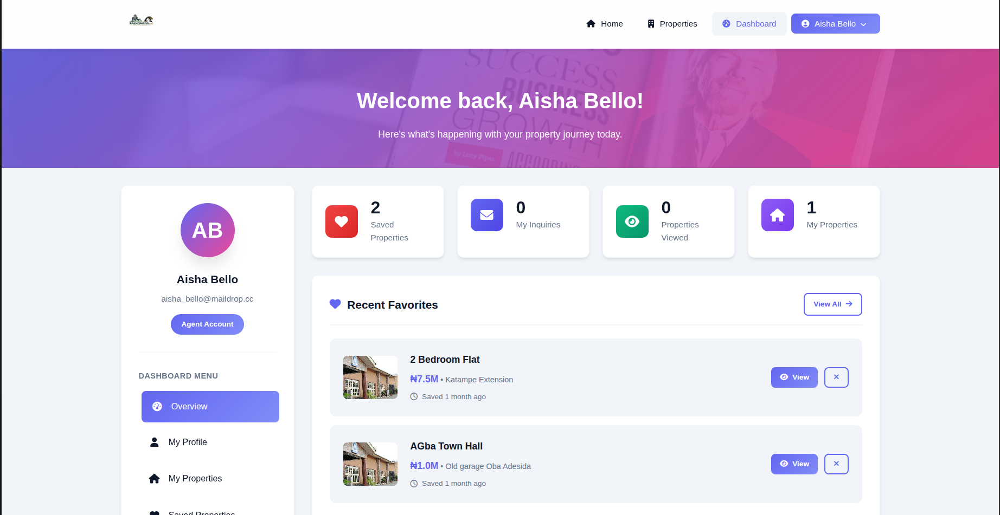
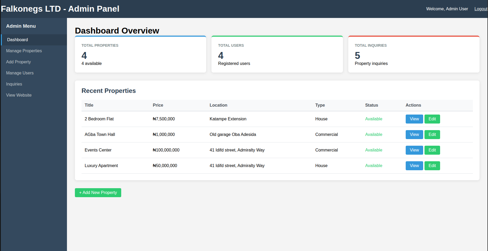
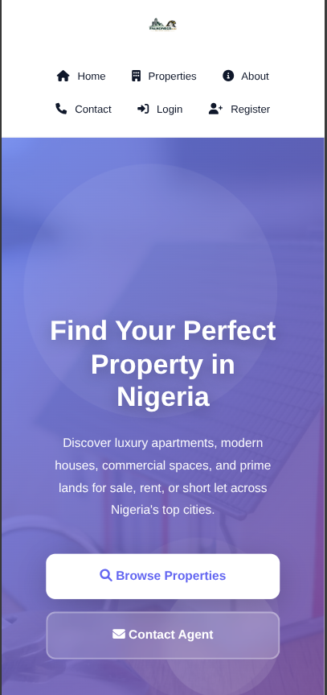

# Falkonegs Property Portal - Real Estate Website

**Live Site:** [https://falkonegsltd.com](https://falkonegsltd.com)  
**Client:** Falkonegs LTD - Property Investment Company  
**Role:** Full-Stack Developer  
**Timeline:** 3 months  
**Status:** Live in Production

---

## Project Overview

Falkonegs Property Portal is a custom-built real estate platform for a Nigerian property investment company. The site enables property listings, user inquiries, and client management.

The client needed a platform that:
- Showcases properties for sale, rent, and short let
- Allows users to search and filter properties
- Provides user accounts for saving favorites
- Captures inquiries and contact form submissions
- Gives admin panel for property management

---

## Technical Stack

**Backend**
- PHP 8.3
- MySQL 8.0
- PDO for database access

**Frontend**
- HTML5, CSS3, JavaScript
- Font Awesome icons
- Fully responsive design

**Features**
- User authentication system
- Property search and filtering
- Favorite/save properties
- Contact forms with database storage
- Admin content management

---

## Key Features

**Public Website**
- Homepage with hero section and featured properties
- Property listing page with filters (type, location, price)
- Property detail pages with images and descriptions
- About and contact pages
- Responsive design for mobile and tablet

**User Accounts**
- Registration and login system
- Password reset functionality
- User dashboard
- Save favorite properties
- View inquiry history

**Admin Panel**
- Add, edit, delete properties
- Upload property images
- Manage featured properties
- View and respond to inquiries
- View contact form submissions

---

## Database Overview

The database uses 14 tables with proper relationships and indexing for performance.

**Core Tables:**
- `users` - User accounts (clients, agents, admins)
- `properties` - Property listings with details
- `property_images` - Multiple images per property
- `inquiries` - Property-specific inquiries
- `contact_messages` - General contact form submissions
- `user_favorites` - Saved properties per user
- `user_profiles` - Extended user information

**Supporting Tables:**
- `states` - Nigerian states for dropdowns
- `search_suggestions` - Popular search tracking
- `viewing_history` - User property views
- `popular_searches` - Analytics for search trends
- `password_resets` - Password recovery tokens
- `user_notifications` - In-app notifications
- `property_comparisons` - Compare properties feature

---

## Screenshots

| Homepage | Property Listing | Property Details |
|----------|------------------|------------------|
|  |  |  |

| User Dashboard | Admin Panel | Mobile View |
|----------------|-------------|-------------|
|  |  |  |

### Full Galleries

- [Homepage Screenshots](_screenshots/01-homepage/) - Hero, featured properties, features section
- [Property Listing](_screenshots/02-property-listing/) - Filter sidebar, grid/list views, search results
- [Property Details](_screenshots/03-property-details/) - Gallery, details, contact form
- [User Dashboard](_screenshots/04-user-dashboard/) - Login, registration, saved properties
- [Admin Panel](_screenshots/05-admin-panel/) - Property management, inquiries, users
- [Mobile Views](_screenshots/06-mobile/) - Responsive design on phone screens
---

## Technical Implementation

**Property Search:**
The search functionality filters by property type, transaction type (sale/rent/shortlet), location, and price range. Results are paginated for performance.

**Image Management:**
Properties support multiple images with primary image designation. Image fallbacks handle missing files gracefully.

**User Favorites:**
Logged-in users can save properties to favorites. The system tracks favorites per user and displays them in the dashboard.

**Inquiry System:**
Property-specific inquiries go to the database and email notifications to agents. Contact form submissions are stored and marked as read/replied.

**Admin Features:**
Custom admin panel with property CRUD operations, image uploads, and inquiry management. Featured properties can be toggled from admin.

---

## Challenges Solved

**1. Property Image Handling**
The client needed multiple images per property with a primary image. Solution uses separate property_images table with is_primary flag. Image fallbacks for missing files.

**2. Search Performance**
Property searches with multiple filters needed optimization. Solution uses indexed columns and prepared statements to prevent SQL injection while maintaining speed.

**3. User Session Management**
Custom authentication system with remember-me functionality. Password reset flow with email tokens and expiration.

**4. Responsive Design**
The site needed to work on mobile devices where most users browse. Solution uses CSS Grid and Flexbox with media breakpoints.

---

## Production Metrics

- **Properties Listed:** 50+
- **Monthly Visitors:** 2,000+
- **Inquiries Received:** 100+ per month
- **User Accounts:** 150+ registered
- **Page Load Time:** Under 2 seconds

---

## Repository Purpose

This repository contains documentation and screenshots only. The actual source code is private and proprietary to the client.

For live demo: [https://falkonegsltd.com](https://falkonegsltd.com)

---

## Contact

For questions about this project:
- Email: [nicklaniyi@gmail.com]
- LinkedIn: [https://www.linkedin.com/in/nicklaniyi/]
